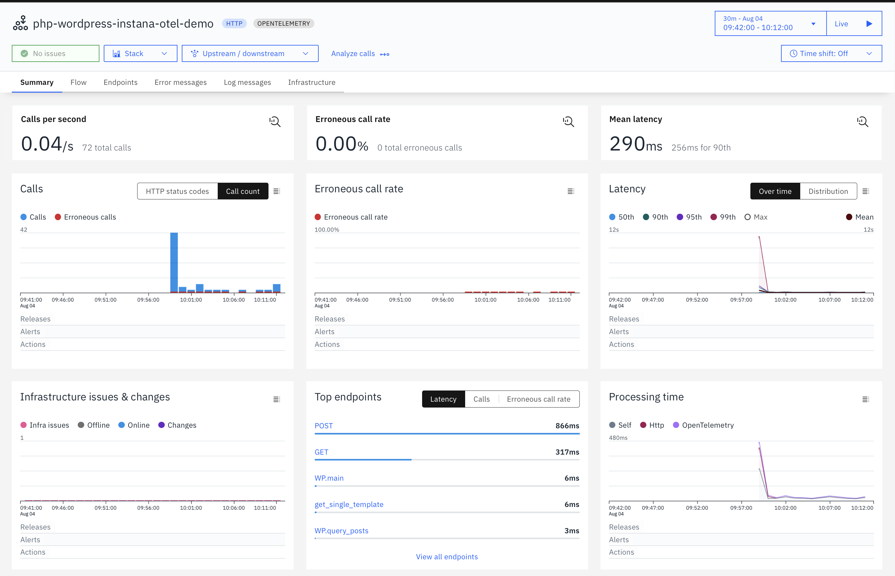

# Instana PHP Otel Tracing demo app

This repository demonstrates Instana's tracing functionality
based on [OpenTelemetry](https://opentelemetry.io/docs/languages/php/).

This example is enhanced version of [OpenTelemetry Wordpress Instrumentation](https://github.com/open-telemetry/opentelemetry-php-contrib/tree/main/examples/instrumentation/Wordpress).
This example autoinstruments the Wordpress docker image with OTel and Instana.

The OTel traces are sent to the Instana agent via gRPC/http to port 4317/4318.

## Prerequisites

A `docker-compose` installation running on your machine.

## Configure

Create a `.env` file copied from `.env.template` file and update below values.

```text
agent_key=<agent secret key>
download_key=<download secret key (optional agent key with download privileges)>
agent_zone=<name of the zone for the agent; default: envoy-tracing-demo>
agent_endpoint=<local ip or remote host ingress-red-saas.instana.io>
agent_endpoint_port=<443 already set as default; or 4443 for local>
```

## Build & Launch

```bash
docker-compose up --build -d
```

This will build and launch the following components:

- `wordpress` service, a simple wordpress application.
- `mariadb database` service, database for wordpress application.
- `instana agent` service, Instana agent listening on grpc/http endpoint.

## Running it

Then, go to `http://localhost:8080` to set up Wordpress site.

## Visualize traces

The resulting traces in the Analyze view will look like this in Instana UI:
Service Name is **php-wordpress-instana-otel-demo**



## Distributed Tracing test app

This is an example of manual context propagation between services.

This app constitutes of service1.php, service2.php and service3.php.
The requests go from service1 to service2 and service2 to service3.
It extracts context headers from root span(sdk.php) to child spans(service1, service2).

**To run distributed app:**

Exec in to the container and start the service1, service2 and service 3 as below:

```sh
php -S 0.0.0.0:8004 service1.php &
php -S 0.0.0.0:8002 service2.php &
php -S 0.0.0.0:8003 service3.php &
```

Trigger the call to service1 either by direct curl or php

```sh
curl http://localhost:8004/service1.php
```

OR

```sh
php sdk.php
```
